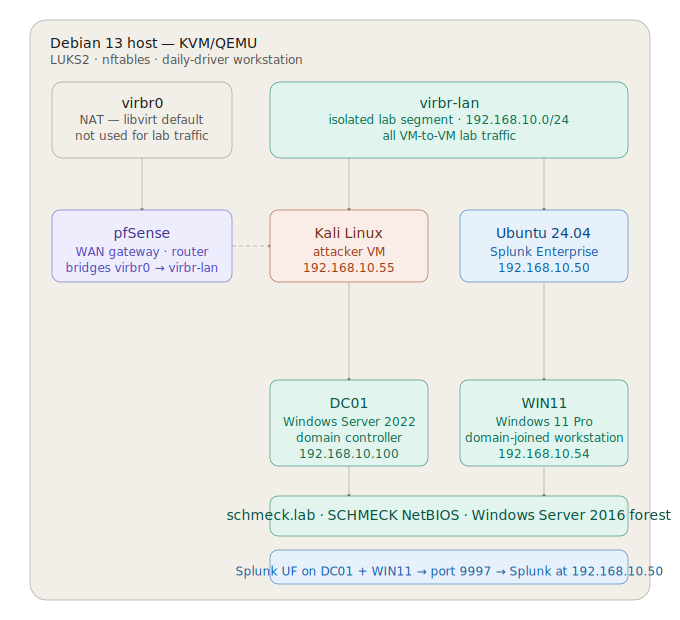

# Homelab Architecture

This directory contains the network topology diagram for the `schmeck.lab` homelab environment. For full environment documentation — VM inventory, domain configuration, SIEM setup, and network details — see the [homelab configuration README](../README.md).

---

## Network Diagram

---

## Reading the Diagram

The outermost container represents the physical Debian 13 host. Everything inside it runs as a KVM/QEMU virtual machine.

Two virtual networks are shown at the top. `virbr0` is the libvirt default NAT network — it exists on the host but carries no lab traffic. `virbr-lan` is the isolated lab segment where all VM-to-VM communication occurs.

pfSense bridges the two networks, providing WAN connectivity and routing for the lab segment. The dashed line between pfSense and `virbr-lan` represents this bridging relationship.

Kali, Ubuntu/Splunk, DC01, and WIN11 all connect to `virbr-lan` and communicate on the `192.168.10.0/24` subnet. DC01 and WIN11 are domain-joined to `schmeck.lab`. Both forward Windows Event Logs to Splunk Enterprise on Ubuntu via the Splunk Universal Forwarder on port 9997.
