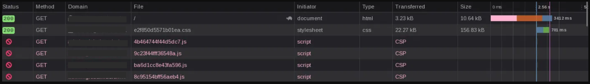

# OSINT Case Study — Smishing Job Scam Investigation

**Author:** [@aschmeck](https://github.com/aschmeck)
**Target Role:** SOC Analyst / Cybersecurity Analyst
**Lab Type:** Blue Team — OSINT / Fraud Investigation
**Environment:** Personal device, isolated VM, controlled browsing environment, public-source tooling

---

## Objective

Investigate a smishing-based job scam that targeted my personal phone number, preserve evidence, identify fraud infrastructure, and document the investigation as a defensive OSINT case study.

The goal of this project was not retaliation, attribution to a real-world individual, or unauthorized access. The goal was to treat the scam attempt as a live security incident: preserve the original messages, identify infrastructure used by the operation, analyze social engineering patterns, document technical indicators, and define appropriate reporting paths.

This write-up redacts sensitive indicators and avoids publishing operational details that could enable abuse of the same infrastructure.

---

## Scope and Ethics

This investigation was limited to defensive OSINT and public-facing infrastructure review.

The following activities were considered in scope:

* Preserving scam messages, screenshots, voice memos, timestamps, and URLs
* Reviewing public DNS records
* Reviewing WHOIS / RDAP-style registration and IP allocation data
* Checking certificate transparency records
* Reviewing public web headers and visible page metadata
* Identifying web technology fingerprints exposed by the scam infrastructure
* Analyzing scammer interaction patterns and social engineering behavior
* Documenting reporting paths for fraud, smishing, and abuse complaints

The following activities were considered out of scope:

* Attempting to bypass authentication
* Exploiting exposed backend systems
* Accessing non-public victim, operator, or administrative data
* Publishing full IP addresses, phone numbers, invitation codes, or tracking artifacts
* Retaliating against the scammer or attempting to deanonymize a private individual
* Encouraging harassment, doxxing, or unauthorized access

During the investigation, a public-facing backend misconfiguration was observed. Because this type of issue can expose sensitive operational data, I documented the existence and risk of the finding but did not attempt to extract historical request data, access private records, or use the exposure to interfere with the system.

---

## Problem Statement

Smishing attacks are often treated as disposable, low-value spam. In practice, many of these campaigns are supported by reusable infrastructure, operator workflows, scripted social engineering, and fraud platforms designed to convert victims over time.

This case began as an unsolicited "job opportunity" message sent to my personal phone number. The interaction escalated from SMS/iMessage contact into a fake recruiting workflow involving multiple personas, a branded web portal, invitation-code registration, and repeated follow-up messages.

The investigation focused on answering four questions:

1. What infrastructure supported the scam?
2. Was the campaign a simple one-off phishing page or part of a larger managed fraud platform?
3. What technical and behavioral indicators could be documented safely?
4. What should be reported, redacted, and retained as evidence?

---

## Environment

| Component                 | Details                                                                                |
| ------------------------- | -------------------------------------------------------------------------------------- |
| Initial Targeting Channel | Personal phone number via SMS / iMessage                                               |
| Scam Type                 | Smishing-based job / task scam                                                         |
| Lure Theme                | Fake job opportunity using a music-rights-themed brand impersonation                   |
| Research Systems          | Personal workstation, isolated Kali VM, iPhone terminal tooling                        |
| Network Controls          | Controlled browsing environment, isolated VM for sandboxed activity                    |
| Primary Tool Categories   | DNS, WHOIS/RDAP, certificate transparency, HTTP header review, browser developer tools |
| Evidence Types            | Screenshots, message history, voice memos, DNS records, WHOIS data, HTTP metadata      |

---

## Initial Contact

The scam began with an unsolicited job opportunity message. The sender used a recruiter-style pretext and attempted to move the interaction toward a web portal associated with the fake opportunity.

The early conversation showed several common scam characteristics:

* Vague job opportunity language
* Multiple named personas used across the interaction
* Claimed referral or recruiting context
* Movement toward a branded portal controlled by the scammer
* Invitation-code-based registration
* Language suggesting future withdrawals or earnings
* Continued follow-up through casual conversation and voice messages

The campaign matched the pattern of a task-based job scam. In this model, victims are typically asked to complete simple online "tasks," shown a fake account balance, and later pressured to deposit funds to unlock withdrawals, upgrade account status, pay fees, or complete higher-value task sets.

---

## Evidence Handling

Evidence was preserved as if documenting a real security incident.

| Evidence Type                    | Purpose                                                                     |
| -------------------------------- | --------------------------------------------------------------------------- |
| Original messages                | Establish initial contact, scam script, phone number, and timeline          |
| Screenshots                      | Preserve portal appearance, interaction flow, and visible branding          |
| Voice memos                      | Document persistent contact and operator behavior                           |
| Domain records                   | Identify infrastructure and hosting relationships                           |
| WHOIS / IP allocation data       | Identify network owners and abuse-reporting paths                           |
| Certificate transparency records | Identify related subdomains and infrastructure expansion                    |
| HTTP metadata                    | Fingerprint hosting, server stack, and framework indicators                 |
| Behavioral notes                 | Document scripted responses, rapport-building attempts, and inconsistencies |

Sensitive details were redacted in this public write-up. Internal notes retained the full artifacts for possible reporting, but the portfolio version focuses on methodology, findings, and defensive analysis.

---

## Investigation Workflow

The investigation followed a staged OSINT workflow:

1. Preserve original messages and timestamps
2. Identify domains, subdomains, links, phone numbers, and invitation codes
3. Resolve DNS records for the primary domain and visible subdomains
4. Review nameservers, MX records, TXT records, and reverse DNS
5. Review WHOIS / IP allocation data for hosting providers and abuse contacts
6. Query certificate transparency records for additional subdomains
7. Review public HTTP headers and visible page metadata
8. Fingerprint the web stack from exposed frontend and backend artifacts
9. Compare technical indicators against the social engineering flow
10. Document findings, attribution limits, and reporting paths

The workflow was designed to remain within public-source and externally visible evidence. The goal was to map the fraud infrastructure, not to intrude into it.

---

## Findings

### Messaging and Social Engineering

The scammer used a job-opportunity pretext rather than an urgent account-security lure. Job scams rely on trust-building over time instead of immediate panic.

Observed social engineering behaviors included:

* Friendly, low-pressure opening contact
* Use of recruiter-style personas
* Repeated follow-up after delayed responses
* Transition from text messages to voice memos
* Casual rapport-building using non-work topics
* Attempts to keep the target engaged without immediately forcing payment
* Repetitive or shallow responses when asked specific questions outside the expected script

One useful behavioral test involved casual sports conversation. When asked a question that required actual knowledge of the topic, the operator responded with a vague, repetitive answer and ignored a related comment about a specific national team. This supported the assessment that the interaction was scripted or semi-scripted rather than a genuine conversation.

This is useful defensively because scammer behavior can be evaluated the same way phishing content is: not only by technical indicators, but also by response timing, consistency, topic handling, and deviations from normal human conversation.

| Behavior                                       | Defensive Interpretation                                               |
| ---------------------------------------------- | ---------------------------------------------------------------------- |
| Multiple names used during the interaction     | Possible shift handoff, scripted personas, or poor operator continuity |
| Voice memos sent after text engagement         | Increased effort to build trust and humanize the scam                  |
| Shallow responses to specific questions        | Scripted or semi-scripted interaction                                  |
| Ignoring location-specific conversational cues | Operator avoided or failed to engage with unscripted regional topic    |
| Continued follow-up without immediate pressure | Nurture phase of a task scam                                           |
| Casual topic re-engagement                     | Attempt to restart rapport after stalled conversion                    |

The voice memos were notable because they increased perceived legitimacy. A victim may interpret audio contact as proof that the recruiter is real. In reality, voice memos are compatible with organized scam operations and can be used to increase trust without exposing meaningful identity information.

### Domain and DNS

The scam used a domain designed to impersonate or borrow legitimacy from a real-world business theme. The domain hosted multiple subdomains for distinct operational roles.

| Role                  | Description                                            |
| --------------------- | ------------------------------------------------------ |
| Primary domain        | Public-facing lure or brand impersonation site         |
| App subdomain         | Victim-facing login or task portal                     |
| Admin subdomain       | Management interface for operators                     |
| Backend subdomain     | API or backend service supporting the portal           |
| Additional subdomains | Related aliases or previously issued certificate names |

Notable DNS observations:

* Multiple A records across distinct infrastructure roles
* Separate subdomains for victim and operator workflows
* Nameservers associated with a non-US provider
* Missing or minimal mail infrastructure

The lack of mature mail infrastructure was expected: the scam relied entirely on phone-based messaging, so the domain only needed to support web-based conversion.

### Hosting and WHOIS

WHOIS and IP allocation review identified Vietnamese hosting or network infrastructure associated with the scam domain and subdomains. The infrastructure was not hidden behind a major CDN, which made abuse-reporting paths easier to identify directly from DNS records.

Hosting and WHOIS findings were treated as infrastructure indicators only — not proof of the scammer's physical location or identity. IP-based attribution is limited because infrastructure can be rented, resold, compromised, proxied, or shared.

### Certificate Transparency and Subdomain Discovery

Certificate transparency records revealed additional subdomains beyond those visible in the original scam message. This was one of the most valuable passive OSINT steps because certificate issuance exposed the broader application structure without brute-forcing or intrusive enumeration.

| Subdomain Category | Likely Purpose                                          |
| ------------------ | ------------------------------------------------------- |
| App / portal       | Victim login and task workflow                          |
| Admin / CMS        | Operator management interface                           |
| Backend / API      | Application backend or service layer                    |
| User / account     | Possible user-facing dashboard or historical deployment |
| Alternate aliases  | Possible staging, redirects, or unused records          |

One subdomain appeared in certificate transparency records but did not resolve in DNS at the time of review, suggesting it may have been decommissioned or used during a prior stage of the operation.

The multi-component architecture supported the conclusion that this campaign was likely operated through a reusable fraud platform rather than a simple one-page phishing lure.

### Web Technology Fingerprinting

Public page metadata and response behavior indicated a multi-tier web application.

| Layer                  | Observation                                                           |
| ---------------------- | --------------------------------------------------------------------- |
| Victim-facing frontend | Modern JavaScript application                                         |
| Admin-facing frontend  | Separate management-oriented web interface                            |
| Backend                | PHP/Laravel-style application behavior                                |
| Web server             | LiteSpeed/OpenLiteSpeed-style hosting behavior                        |
| UI components          | Mobile-oriented component patterns consistent with task-portal design |
| Error handling         | JSON error responses from backend routes                              |
| Localization           | Vietnamese-language error message observed                            |

The backend returned structured JSON responses and included Vietnamese-language error messaging — one of the strongest indicators connecting the backend implementation to Vietnamese-speaking operators or developers. This does not prove the scammer's nationality, but it is a meaningful infrastructure-development clue.

Browser developer tools confirmed the separation between the victim-facing portal and the admin interface. The network tab captured during review of the admin subdomain showed the initial document request completing successfully (HTTP 200) while all four JavaScript bundle requests were blocked by Content Security Policy.

*Admin subdomain network activity captured during passive review. Domain redacted. The document and stylesheet loaded successfully; four JavaScript bundles were blocked by Content Security Policy in the test browser. Load time on the initial document request exceeded 3.4 seconds.*

This CSP behavior was retained as a production hygiene observation. The result suggests a possible policy or deployment mismatch, but it was not treated as proof of exploitability or used to attempt access.

### Backend Misconfiguration

A public-facing development/debug artifact was observed on the backend server, consistent with Laravel debugging tooling left active in production.

This type of exposure can reveal framework and runtime versions, server filesystem paths, application environment details, request metadata, and internal route or session behavior.

No attempt was made to extract private data, access victim or administrative records, or exploit the exposure. The finding was documented as a production misconfiguration and retained as an abuse-reporting indicator.

From a defensive standpoint, this was one of the strongest technical findings in the investigation. It showed that the scam platform had poor production security hygiene independent of its fraudulent purpose.

---

## MITRE ATT&CK and SOC Workflow Mapping

This investigation maps most directly to phishing, social engineering, resource development, and external threat intelligence workflows. Because no endpoint compromise occurred, the mapping is limited to observed adversary behavior and defensive analysis rather than host-based detection.

| Area | Technique | Relevance |
| ---- | --------- | --------- |
| Initial Access | T1566 — Phishing | The attacker initiated contact through unsolicited messaging and used a fake job opportunity as the lure. |
| Reconnaissance / Targeting | T1598 — Phishing for Information | The interaction attempted to move the target toward a controlled portal where additional personal, account, or financial information could be collected. |
| Resource Development | T1583.001 — Acquire Infrastructure: Domains | The scam relied on a dedicated domain and multiple subdomains to support the fraud workflow. |
| Resource Development | T1583.003 — Acquire Infrastructure: Virtual Private Server | Hosting infrastructure supported the victim portal, admin interface, and backend service. |
| Resource Development | T1585 — Establish Accounts | The operators used messaging accounts, recruiter personas, and phone-based contact to support the campaign. |
| Collection / Fraud Enablement | Input Capture Risk | The portal appeared designed to collect registration details and support later payment or withdrawal manipulation. |

### SOC Procedure Mapping

| SOC Function | What I Practiced |
| ------------ | ---------------- |
| User-Reported Phishing Triage | Treated the initial message as a suspicious user-reported smishing event. |
| Evidence Preservation | Preserved messages, screenshots, timestamps, voice memo context, domains, and infrastructure notes. |
| Indicator Extraction | Extracted phone number, domain, subdomains, hosting indicators, visible web artifacts, and scam language. |
| OSINT Enrichment | Used DNS, WHOIS/RDAP-style records, certificate transparency, HTTP metadata, and public web review. |
| Threat Classification | Classified the activity as a task-based job scam rather than simple credential phishing. |
| Risk Assessment | Assessed likely victim impact, infrastructure maturity, operator behavior, and attribution limits. |
| Escalation / Reporting | Identified reporting paths including IC3, FTC, carrier abuse, registrar, hosting provider, and impersonated brand. |
| Documentation | Produced a sanitized case study suitable for portfolio publication without exposing sensitive live indicators. |

---

## Attacker / Defender Perspective

**Attacker view:** The infrastructure supports a managed conversion funnel. Phone messaging handles initial contact. The branded domain provides legitimacy. The app portal gives the victim a controlled environment where fake tasks, balances, and withdrawals can be presented. The admin interface likely allows operators to track victims, manage accounts, and control scam progression. The core attack is psychological: build trust, show fake value accumulating, then introduce a financial obstacle the victim must pay to overcome.

**Defender view:** Organizations and individuals can detect or disrupt similar campaigns by monitoring:

* Newly registered domains impersonating known brands
* Low-reputation TLDs used in job or payment workflows
* Certificate transparency records for suspicious subdomains
* SMS/iMessage messages that move users to external task portals
* Invitation-code registration workflows tied to unsolicited job offers
* "Withdrawal password," "task balance," "premium task," or "unlock withdrawal" language
* Web portals with poor production hygiene, exposed debug artifacts, or mismatched branding
* VoIP numbers used for recruiting or job scams

For SOC teams, this case reinforces the value of combining technical indicators with human behavior analysis. The domain alone is useful; the full picture comes from the interaction timeline, infrastructure, portal behavior, and operator script.

---

## Attribution Limits

This investigation produced infrastructure and behavioral indicators, not definitive personal attribution.

**Supportable conclusions:**

* The campaign used smishing/iMessage contact to initiate a fake job opportunity
* The scam relied on a branded web portal and invitation-code workflow
* The domain and subdomains supported multiple operational roles
* Hosting and backend artifacts pointed toward Vietnamese infrastructure and Vietnamese-language development indicators
* Operator interaction was consistent with scripted or semi-scripted scam workflows

**Unsupportable conclusions:**

* The real identity of the individual operator
* The physical location of the person sending messages
* Whether the person communicating was acting voluntarily
* Whether the hosting provider knowingly supported fraud
* Whether any single IP address represented the scammer's personal network

Infrastructure attribution is not personal attribution. IP addresses, hosting records, language artifacts, and voice accents are investigative leads, not proof of identity.

---

## Reporting Paths

| Entity                                    | Purpose                                                        |
| ----------------------------------------- | -------------------------------------------------------------- |
| IC3                                       | Report internet-enabled fraud targeting a US person            |
| FTC ReportFraud                           | Report consumer fraud and job scam activity                    |
| Mobile carrier / 7726                     | Report smishing messages and abusive phone numbers             |
| Apple abuse / phishing reporting          | Report abusive iMessage or Apple ID activity                   |
| Domain registrar                          | Report fraudulent or impersonating domain                      |
| Hosting provider                          | Report web infrastructure used for fraud                       |
| Regional internet registry / national NIC | Escalate persistent abuse tied to allocated network resources  |
| Brand owner being impersonated            | Notify legitimate organization of impersonating infrastructure |

A complete report package would include original message screenshots, the phone number used, dates and times of contact, domain and subdomains, redacted portal screenshots, hosting provider information, abuse contacts, a summary of the scam workflow, and documentation of the production misconfiguration without exploitation details.

---

## Defensive Recommendations

| Area                | Recommendation                                                                                                      |
| ------------------- | ------------------------------------------------------------------------------------------------------------------- |
| Personal Security   | Do not provide identity documents, banking details, crypto wallet information, or payment to unsolicited recruiters |
| Messaging           | Report scam SMS/iMessages to carrier and platform abuse channels                                                    |
| Web Safety          | Open suspicious links only in a controlled environment, not from a personal device                                  |
| Evidence            | Preserve original messages and screenshots before blocking the sender                                               |
| Brand Protection    | Report impersonating domains to the legitimate brand owner and registrar                                            |
| Threat Intelligence | Track domains, subdomains, phone numbers, and hosting providers as indicators                                       |
| Reporting           | Submit complete evidence packages to IC3, FTC, registrar, host, and platform providers                              |

---

## Outcome and Lessons Learned

This investigation produced a complete OSINT case study from a real scam attempt, demonstrating practical skills in fraud analysis, evidence handling, infrastructure mapping, and responsible disclosure.

Key takeaways:

* Smishing investigations should be treated like incident response: preserve evidence first, then analyze
* Task scams use a slow conversion funnel rather than immediate credential theft
* Certificate transparency is one of the highest-value passive sources for identifying related scam infrastructure
* Backend error messages can reveal language, framework, and developer-environment clues
* Infrastructure attribution must be handled carefully — hosting location is not proof of operator identity
* Debug artifacts exposed in production are useful defensive findings, but must not be exploited
* Voice memos and casual conversation are part of the social engineering workflow, not proof of legitimacy
* Behavioral analysis can validate technical suspicion when operators fail to respond naturally to unscripted questions
* Redaction improves a public write-up by demonstrating judgment and responsible disclosure discipline

The most important part of this investigation was not finding a single smoking gun. It was building a complete picture from weak signals: a suspicious message, a fake job pretext, a branded domain, a task portal, multiple subdomains, hosting artifacts, backend language clues, a production misconfiguration, and scripted operator behavior. That combination is how real-world investigations work — no single artifact proves everything, but the pattern across messaging, infrastructure, and behavior supports a strong conclusion.

---

## Reference

| Resource                        | Purpose                                                |
| ------------------------------- | ------------------------------------------------------ |
| IC3                             | Internet crime reporting                               |
| FTC ReportFraud                 | Consumer fraud reporting                               |
| 7726 / SPAM                     | Carrier-level SMS abuse reporting                      |
| crt.sh                          | Certificate transparency search                        |
| ARIN / APNIC / LACNIC RDAP      | IP allocation and abuse-contact research               |
| ICANN WHOIS / domain registrars | Domain ownership and registrar abuse contacts          |
| MITRE ATT&CK T1566, T1598, T1583.001, T1583.003, T1585 | Technique framing for phishing, social engineering, and resource development |

---

*Part of the [Cybersecurity Portfolio](https://github.com/aschmeck) by [@aschmeck](https://github.com/aschmeck)*
