# Lab 4 — SOC Dashboard and Alerting
## Splunk Homelab Series | schmeck.lab

**Role Target:** Entry-Level SOC Analyst  
**Lab Type:** Blue Team — SIEM Operations  
**Environment:** Splunk Enterprise 10.2.2 | DC01 (192.168.10.100) | WIN11 (192.168.10.54) | Kali (192.168.10.55) | Domain: schmeck.lab

---

## Objective

Design and deploy an operational SOC dashboard in Splunk that surfaces authentication anomalies, privilege use, process execution, and network indicators across a self-built Active Directory homelab. Configure scheduled alerts with Slack delivery to mirror a real-world SOC notification pipeline. Validate the dashboard and alerting pipeline against simulated attack conditions.

---

## Problem Statement

A SIEM that ingests logs but provides no structured visibility is operationally incomplete. Without a purpose-built dashboard, identifying anomalies requires knowing what to search for before knowing what happened — inverting the analyst workflow. This lab addresses that gap by building a dashboard designed for at-a-glance triage: a SOC analyst logging in should be able to assess the environment's security posture within seconds without running a single ad-hoc query.

---

## Environment

| Component | Details |
|---|---|
| SIEM | Splunk Enterprise 10.2.2 (free tier post-trial) |
| Forwarders | Splunk Universal Forwarder 10.2.2 on DC01 and WIN11 |
| Telemetry | Sysmon v15.20 (olafhartong sysmon-modular config), WinEventLog Security |
| Alert Delivery | Slack App Alert Integration (OAuth token) |
| Domain | schmeck.lab — DC01, WIN11, domain users: ssummers, wworthington, efrost |

---

## Implementation

### Dashboard Design

The dashboard was built using Splunk Classic Dashboard (Simple XML) and set as the default home view. The design follows a triage hierarchy: top-level single-value indicators for immediate counts, followed by timeline and breakdown panels, with raw event tables at the bottom for drill-down.

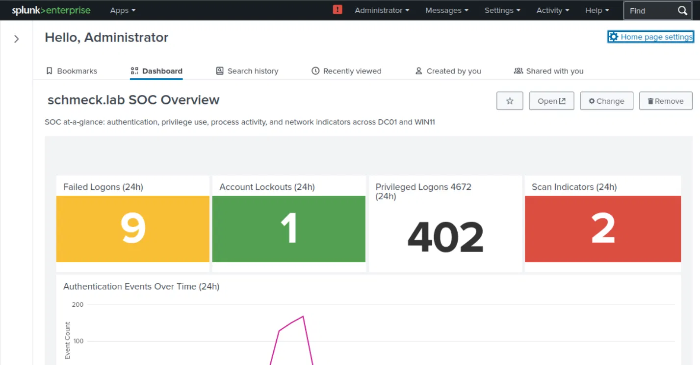

**Panel inventory:**

| Panel | Type | Event IDs | Purpose |
|---|---|---|---|
| Failed Logons (24h) | Single Value | 4625 | At-a-glance brute force indicator |
| Account Lockouts (24h) | Single Value | 4740 | Immediate lockout visibility |
| Privileged Logons (24h) | Single Value | 4672 | Privilege use volume |
| Scan Indicators (24h) | Single Value | 5156 | WFP-based scan detection |
| Authentication Events Over Time | Line Chart | 4624, 4625 | Visual anomaly detection |
| Top Failed Logon Accounts | Bar Chart | 4625 | Per-account failure breakdown |
| Failed Logons by Host | Bar Chart | 4625 | Per-host failure breakdown |
| Sysmon: Suspicious Process Execution | Table | Sysmon EID 1 | LOLBin and tool detection |
| Sysmon: Top Outbound Connections | Table | Sysmon EID 3 | Network behavior visibility |
| Account Lockouts | Event List | 4740 | Lockout event detail |
| Failed Logon Attempts | Table | 4625 | Recent failure detail |
| DA Account Logon | Event List | 4624 | ssummers logon tracking |
| Recent High-Value Events | Table | 4625, 4740, 4672, 4719, 4732, 4728, 1102 | Consolidated triage feed |

Color thresholds were applied to single-value panels: failed logons turn yellow at 5 and red at 20; scan indicators turn red at 1; lockouts turn yellow at 1 and red at 3.

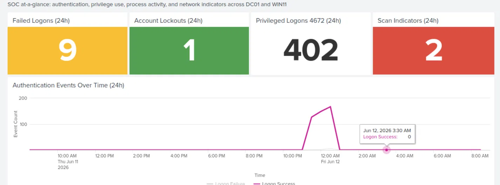

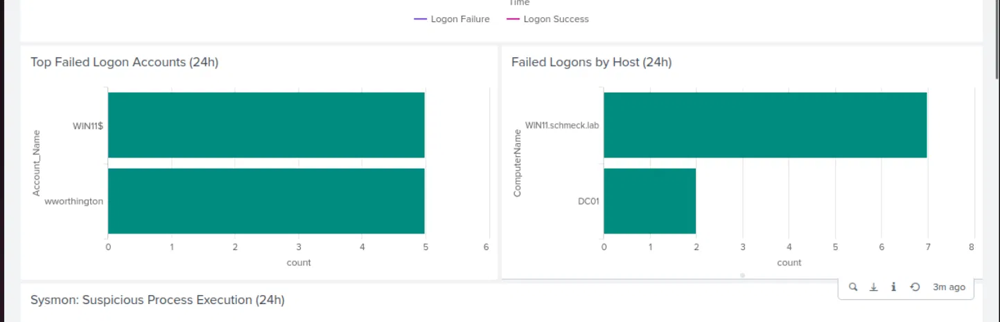

### Alert Configuration

Three scheduled alerts were configured with Slack delivery via incoming OAuth token:

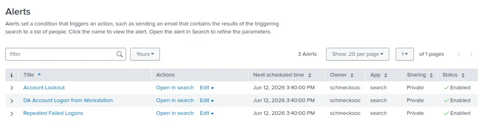

**Alert 1 — Repeated Failed Logons**
- Search: `index=windows EventCode=4625 | stats count by Account_Name, ComputerName | where count >= 5`
- Schedule: every 5 minutes, last 5-minute window
- Throttle: 10 minutes
- MITRE: T1110 — Brute Force

**Alert 2 — Account Lockout Detected**
- Search: `index=windows EventCode=4740`
- Schedule: every 5 minutes, last 5-minute window
- Throttle: 15 minutes
- MITRE: T1110.001 — Password Guessing

**Alert 3 — DA Account Logon from Workstation**
- Search: `index=windows EventCode=4624 Account_Name=ssummers ComputerName=WIN11.schmeck.lab`
- Schedule: every 5 minutes, last 5-minute window
- Throttle: 60 minutes
- MITRE: T1078.002 — Valid Accounts: Domain Accounts

Alert 3 is intentionally scoped to WIN11 only. ssummers authenticating to DC01 is expected behavior; ssummers appearing on the workstation is the lateral movement indicator the alert is designed to catch.

### Domain Lockout Policy

Prior to simulation, the domain had no lockout policy (`LockoutThreshold: 0`). This was identified through `Get-ADDefaultDomainPasswordPolicy` and corrected before Alert 2 could be validated:

```powershell
Set-ADDefaultDomainPasswordPolicy -Identity "schmeck.lab" -LockoutThreshold 5 -LockoutDuration 00:10:00 -LockoutObservationWindow 00:05:00
```

---

## Findings

### Finding 1 — Credential Scanning Activity from Kali (192.168.10.55)

On initial dashboard load, 1,546 failed logon events with blank Account_Name fields were visible against DC01, alongside 50-count failures for usernames including Admin, Administrator, Guest, Test, User, User1, superuser, support, and work. Investigation via `Source_Network_Address` correlation identified the source as 192.168.10.55 — the authorized Kali attack platform.

The usernames matched standard credential testing wordlists. The burst pattern — 20+ attempts within a single second at 4:42 AM on June 10 — is consistent with automated scanner behavior, not interactive authentication. This activity was residual from GVM/Greenbone authenticated scans conducted during the VA lab series (Parts 1–3).

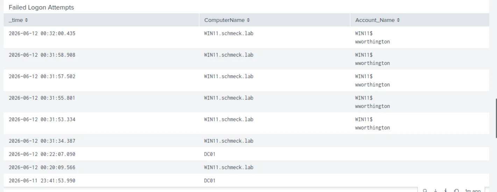

**Disposition:** Authorized activity. Known source, expected behavior from prior lab phase. No incident.

**Portfolio value:** The dashboard surfaced this finding on first load without a prior hypothesis. The full investigation workflow — anomaly detection, source correlation, root cause confirmation, disposition — was completed using only Splunk search and the dashboard panels. This is a Tier 1 SOC triage workflow executed end-to-end.

### Finding 2 — ssummers Failed Logons Against DC01

24 failed logon events for ssummers were recorded against DC01. Cross-referencing with the Kali scan data confirmed these originated from 192.168.10.55 and were part of the same wordlist credential testing activity. ssummers is a domain admin account — its presence in an attacker wordlist, even an internal test one, is worth flagging.

**Disposition:** Authorized VA lab activity. Noteworthy because DA account names should be obscure and not present in standard wordlists.

### Finding 3 — Alert Pipeline Delay from Ingestion Backlog

When the alert simulation was run, Splunk's persistent queue was still processing a large backlog of VA lab events. The IOWait metric spiked to red thresholds, the search scheduler fell behind, and alerts did not fire within their 5-minute window. The backlog events — timestamped from prior lab sessions — continued to trip the Repeated Failed Logons alert every 15 minutes (throttle interval) for several hours after the simulation.

**Root cause:** Splunk was not running continuously during the VA lab phase. Events accumulated in the Universal Forwarder persistent queue and flushed in bulk when Splunk was started, overwhelming the disk I/O on a 16GB RAM KVM host running multiple VMs concurrently.

**Remediation:** Keep Splunk running whenever Windows hosts are active. The persistent queue is designed for brief outages, not bulk historical ingestion.

**Portfolio value:** This finding demonstrates firsthand understanding of SIEM availability as a detection dependency — a real operational concern in enterprise SOC environments where log ingestion gaps directly impact alert fidelity.

---

## Alert Simulation Results

| Simulation | Method | Dashboard Evidence | Slack Delivery |
|---|---|---|---|
| Repeated Failed Logons | 5+ failed logins as wworthington on WIN11 | 4625 events visible, wworthington top account in bar chart | Fired on backlog events; simulation alert delayed by scheduler backlog |
| Account Lockout | Exceeded lockout threshold on wworthington | 4740 event indexed at 00:32, single value panel showed 1 lockout | Pending scheduler recovery |
| DA Account Logon from Workstation | Interactive login as ssummers on WIN11 | 4624 events for ssummers indexed | Pending scheduler recovery |

The simulation data is fully indexed and visible in all relevant dashboard panels. The attack chain — failed logons at 00:31 followed by lockout at 00:32 — is visible in the timestamp correlation between the Failed Logon Attempts table and the Account Lockouts panel.

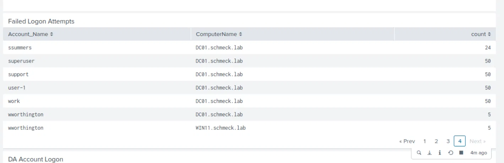

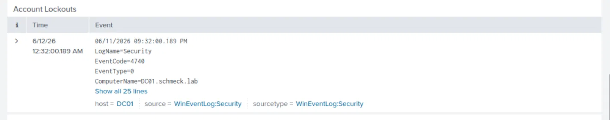

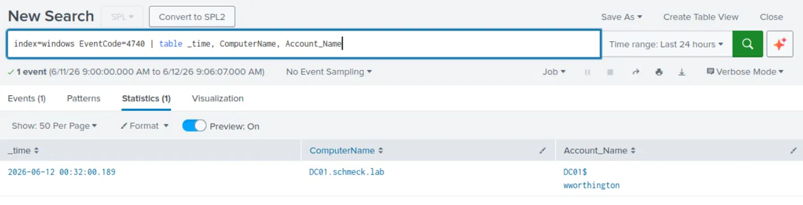

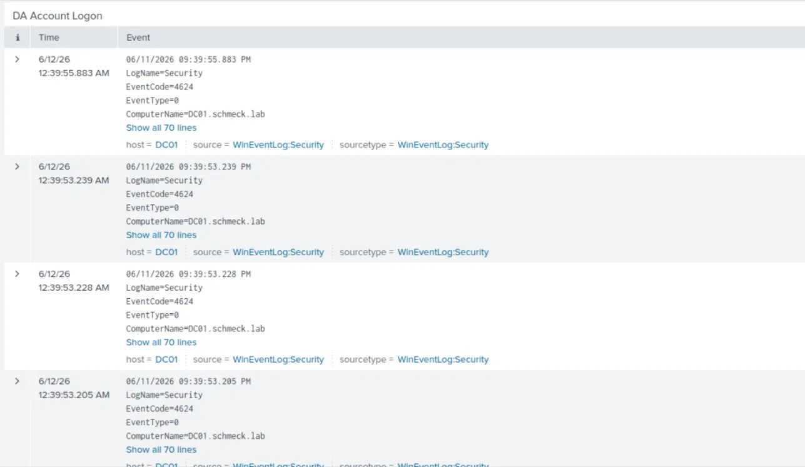

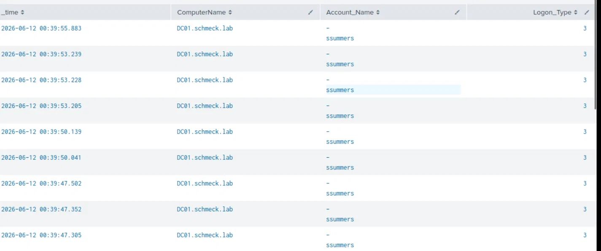

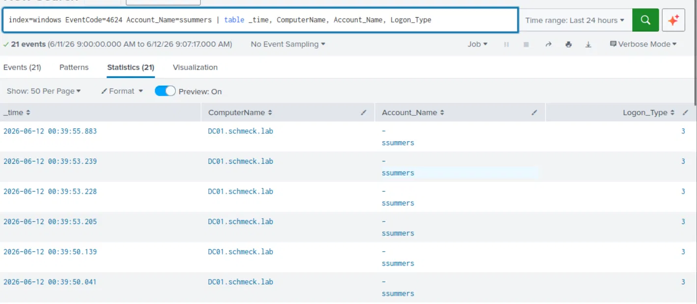

---

## Alert Tuning Notes

Two false positive patterns were identified during validation:

**4672 volume from DC01$ and SYSTEM** — Domain controllers generate high volumes of 4672 events from background services (Kerberos, NTDS, DNS, Group Policy). In a production environment, the Privileged Logons panel would be tuned to exclude machine accounts and SYSTEM, surfacing only human privileged logons.

**Scan Indicators from DC01** — The WFP-based scan detection panel uses unique destination IP count as a proxy for scanning behavior. DC01 legitimately contacts many unique IPs through normal domain operations (DNS resolution, Kerberos lookups, AD replication). This is a known false positive source that would be addressed by excluding DC01's IP from the scan indicator query.

Both represent standard alert tuning work in a SOC environment — the value of identifying them in a homelab is understanding *why* they fire before encountering them in production.

---

## Splunk License Constraint

Splunk Enterprise's free license disables scheduled alerting. This constraint was encountered during the lab and addressed two ways:

1. Alert evidence was captured during the trial window before expiration
2. Alert condition searches were added as dashboard panels, providing passive visibility equivalent to scheduled alert output on dashboard load

This reflects a real operational decision: when a tool's paid features are unavailable, the workflow adapts rather than stops.

---

## Attacker / Defender Perspective

**Defender — what this lab built:**
A dashboard providing Tier 1 triage visibility across authentication, privilege use, process execution, and network behavior. Alerts delivering real-time notification for brute force indicators (T1110), account lockouts (T1110.001), and DA account misuse (T1078.002).

**Attacker — how to evade these detections:**

- **Brute force threshold evasion:** Slow-and-low password spraying (1 attempt per account per hour) stays below the 5-attempt threshold. The alert does not fire if attempts are distributed across many accounts rather than concentrated on one.
- **Lockout evasion:** Staying below the lockout threshold (4 attempts per account) avoids both the 4740 event and the lockout itself. An attacker with a known password policy can spray exactly to the threshold.
- **DA account visibility:** The Alert 3 search is based on Account_Name matching. If an attacker pivots to a different privileged account not in the watch list, it won't fire. Production environments use group membership-based detection rather than named account matching.
- **4672 noise:** The high volume of 4672 events from DC services creates an environment where a real privileged logon can be missed without additional filtering. Attackers abusing service accounts may blend into this noise.

**MITRE ATT&CK references:** T1110 (Brute Force), T1110.001 (Password Guessing), T1078.002 (Valid Accounts: Domain Accounts), T1562.006 (Impair Defenses: Indicator Blocking — relevant to the lockout threshold evasion pattern)

---

## Lessons Learned

**Keep Splunk running continuously.** The persistent queue is a buffer, not a batch ingestion mechanism. Running Splunk only during active lab sessions creates ingestion bursts that delay alerts, spike IOWait, and backfill the dashboard with historical timestamps rather than real-time data.

**Alert thresholds require environment-specific tuning.** A threshold of 5 failed logons in 5 minutes is meaningful for a human attacker but irrelevant noise when a scanner runs 1,500 attempts overnight. Alert logic needs to account for the lab's own authorized activity patterns.

**Field names require verification before use.** The `IpAddress` field assumed in initial queries did not match the actual extracted field (`Source_Network_Address`) in WinEventLog 4625 events. Confirming field names with `| fieldsummary` before building queries is standard practice.

**Dashboard panels as a free-tier alerting workaround** are a reasonable operational adaptation. The passive visibility provided by dashboard panels is sufficient for a homelab where the analyst is also the only user.

---

## Connection to SOC Analyst Role

This lab directly mirrors the day-to-day responsibilities of a Tier 1 SOC analyst:

- Building and maintaining dashboard visibility for shift handoff and at-a-glance triage
- Configuring and tuning scheduled alerts to reduce false positive fatigue
- Investigating anomalies surfaced by the dashboard (the Kali credential scan finding)
- Correlating event timestamps to reconstruct attack sequences (failed logons → lockout chain)
- Understanding SIEM availability as a detection dependency, not just a tool

The unplanned finding — 1,500+ failed logons surfaced on first dashboard load, investigated, attributed, and dispositioned — demonstrates the core SOC analyst skill of converting raw event volume into an actionable conclusion.

---

*Note: Slack alert delivery screenshots to be added once the scheduler backlog from the VA lab scan events has fully cleared.*
