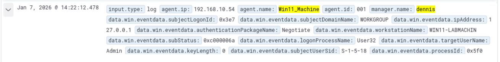
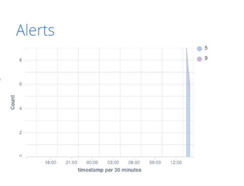
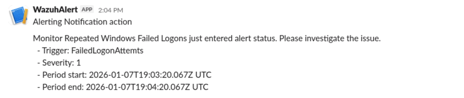

# Wazuh Alert Optimization — Windows Failed Logon Alerts to Slack

**Author:** [@aschmeck](https://github.com/aschmeck)  
**Target Role:** SOC Analyst / Cybersecurity Analyst  
**Lab Type:** Blue Team — Alert Operationalization / Detection Tuning  
**Status:** Archived / Legacy SIEM Project  
**Original SIEM:** Wazuh  
**Current Portfolio SIEM:** Splunk Enterprise

---

## Current Status

This project is retained as a standalone legacy project from an earlier SIEM iteration of the homelab. The current `schmeck.lab` environment uses Splunk Enterprise for SIEM collection, dashboards, alerting, and investigation workflows.

The Wazuh environment used for this lab is no longer part of the active homelab. The screenshots and notes preserved here represent the available evidence from the original implementation. This project is not intended to describe the current monitoring architecture.

The value of this project is the workflow it demonstrates: taking an existing detection, validating that it fires, identifying an operational visibility gap, and routing actionable alerts to Slack so responders do not have to manually watch a dashboard.

---

## Objective

Operationalize repeated Windows failed logon detection by routing high-signal Wazuh alerts to an external notification channel.

The goal was not to build a new detection rule from scratch. The goal was to close the gap between detection and response by turning passive dashboard events into real-time responder notifications.

---

## Environment at Time of Lab

| Component | Details |
|---|---|
| Endpoint | Windows 11 |
| SIEM | Wazuh |
| Notification Platform | Slack |
| Attack Simulation | Manual brute-force password attempts |
| Alert Source | Windows Security Event Logs |
| Wazuh Rule | Rule ID `60122` |

---

## Problem Statement

Wazuh successfully detected repeated failed Windows logon attempts using an existing rule, but the alerts were only visible inside the Wazuh dashboard.

That meant detection existed, but operational visibility did not. In a SOC workflow, high-risk authentication activity should reach responders quickly without requiring constant manual dashboard review. Dashboards are useful for investigation; they are terrible as the only notification mechanism, because humans keep doing ridiculous things like sleeping.

---

## What I Did

1. Generated repeated failed logon attempts against a Windows 11 endpoint.
2. Confirmed Wazuh rule `60122` consistently fired from Windows Security Event Log data.
3. Verified the events appeared in Wazuh Alerts and Threat Hunting.
4. Configured Slack alert delivery using a modern Slack application rather than deprecated incoming webhooks.
5. Triggered the failed logon condition again.
6. Confirmed the alert reached Slack in real time.
7. Preserved available screenshots showing the Wazuh rule, alert visualization, and Slack notification.

---

## Detection Logic

| Field | Value |
|---|---|
| Trigger | Repeated Windows failed logon attempts |
| Time Window | 5 minutes |
| Detection Source | Windows Security Event Logs |
| Wazuh Rule | `60122` |
| Delivery Method | Slack channel notification |

This was an alert operationalization exercise rather than a custom rule-writing exercise. The existing Wazuh rule was sufficient; the workflow gap was alert delivery.

---

## Evidence

The preserved screenshots show the original implementation evidence available for this archived project.

### Wazuh Rule Evidence

### Alert Count Visualization

### Slack Alert Delivery

---

## Outcome

- Repeated failed Windows logon activity was detected by Wazuh.
- Alerts transitioned from passive dashboard visibility to active Slack notification.
- The workflow demonstrated how an existing detection can be made operational without writing a new rule.
- The project established an early alert-routing pattern later superseded by Splunk-based alerting in the active homelab.

---

## Skills Demonstrated

- Windows authentication event analysis
- Wazuh alert validation
- Alert operationalization
- Slack notification integration
- Brute-force simulation for detection testing
- SOC workflow improvement
- Detection-to-response pipeline thinking
- Documentation of legacy security tooling without overstating current architecture

---

## Lessons Learned

- A detection is not operational until someone is notified when it matters.
- Existing SIEM rules are often useful but underutilized.
- Alert routing can produce more immediate value than creating another dashboard panel.
- Slack or chat-based alerting should be tuned carefully to avoid noise fatigue.
- Deprecated tooling can still demonstrate valid security operations thinking when clearly labeled as legacy work.

---

## Future Improvements at the Time

These were the logical next steps when Wazuh was still active:

- Restrict Slack notifications to higher-severity authentication alerts.
- Add user- and source IP-based thresholding to reduce noise.
- Correlate failed logon events with firewall or network logs.
- Add suppression logic for known benign testing activity.
- Create escalation guidance for repeated failed logons from unusual sources.

Because the active homelab has since moved to Splunk Enterprise, these improvements are preserved as historical notes rather than current implementation tasks.

---

## Relationship to Current Portfolio

This project should be read as an earlier alert-operationalization exercise. The current active SIEM and SOC workflow work is documented in:

- [Active Directory SIEM Build](../active-directory-siem/README.md)
- [SOC Dashboard and Alerting Pipeline](../soc-dashboard-alerting/README.md)

Wazuh remains valuable here because it shows the same operational principle in an earlier toolset: alerts are only useful when they reach the responder in time to matter.

---

*Part of the [Cybersecurity Portfolio](https://github.com/aschmeck/cybersecurity-portfolio) by [@aschmeck](https://github.com/aschmeck)*
